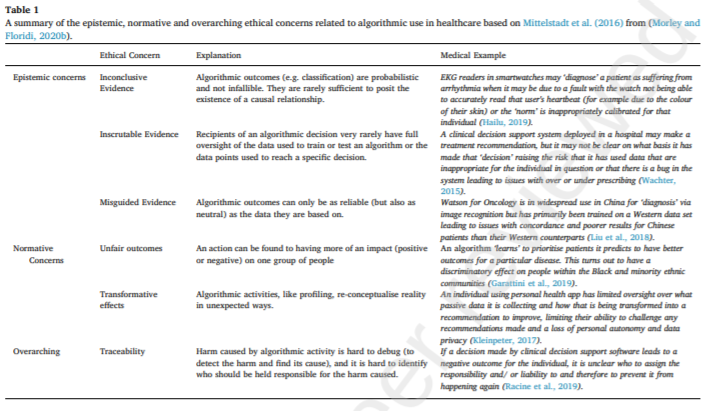

# Notes

### Randomized Controlled Trials in Medical AI(2021)
- Motivates need for RCTs in Medical AI
- Shows multiple challenges/biases in RCTs as well as some mitigation

**Verdict:** probably not relevant for our topic, maybe check some of the citations

### Ensuring Fairness in ML(2018)
- Presents two case studies
- Shows different biases in mAI 
- Introduces three "Distributive Justice Options" to explain different fairness concepts (high-level overview)
- Gives recommendations on how one could incorporate fairness concerns into ML 

**Verdict:** very high level, no concrete focus on ethics, rather general fairness in mAI

### The Ethics of Machine Learning in Medical Sciences: Where Do We Stand Today?
**Source:** https://www.ncbi.nlm.nih.gov/pmc/articles/PMC7640783/

-
-
-

**Verdict:** e

### Ethical Considerations of Using Machine Learning for Decision Support in Occupational Health: An Example Involving Periodic Workers' Health Assessments
**Source**: https://link.springer.com/content/pdf/10.1007/s10926-020-09895-x.pdf.  
**Summary**: Ethical assessment of the impact of Machine Learning Decision Support Tools in occupational health according to frameworks from medical ethics (Beauchamp and Childress) and philosophy of technology.
Ethical dilemmas arising from opposing principles.
Effects of technology on pre-existing problems.  
**Assessment**: not practical, not math. Strong on ethics. Very relevant, important discussion on several trade-offs.  
**Topics**:  
 - Philosophy of technology.
 - Beauchamp and Childress principles.
 - Case study.
 - Type: ethical deliberation.
 - Ethical issues typical of the application (problem) and of the technology (solution).
 - Conflict individual (data privacy etc.) => non-maleficence vs group => beneficence (trade-off).
 - Trade-off privacy vs predictability.
 - Trade-off non-discrimination vs predictability. 
 - Ethical dilemmas.

### Ethical limitations of algorithmic fairness solutions in health care machine learning
**Source**: https://www.thelancet.com/journals/landig/article/PIIS2589-7500(20)30065-0/fulltext.  
**Summary**: algorithmic solutions for bias are insufficient alone.
Identity could be a true predictor as well as a source of discrimination.
Fairness could reduce the efficacy of trained models, and bring to less effective treatment of patients.  
**Assessment**: Short, high-level, at most source of quotes.
**Topics**:  
 - Insufficiency of algorithmic solutions to bias.
 - Trade-off fairness-predictability.
 - Non-maleficience vs justice.
 - Protected attributes as predictors vs as sources of unequal treatment.

### Algorithm Fairness in AI for Medicine and Healthcare
**Source**: https://arxiv.org/abs/2110.00603.  
**Summary**: Honest overview of problems and solutions in applying ML to health (different applications: scans, structured data predictions, decision systems, clustering, ...). Shows how the discussion is not black-or-white, but needs to weigh fairness and efficacity. Hard to summarize, see the breadth of topics below.  
**Assessment**: Good mix technical-ethical (mostly technical though). Some mentions of trade-offs, which are mostly secondary in the text though. Well-worth a read.  
**Topics**: 
  - Examples of health disparities.  
  - Historical bias (p. 3); negative legacy, labeling prejudice (p. 6).  
  - Protected attributes as true predictors (p. 3, p. 16).  
  - Dataset shift (p. 4, p. 12).  
  - Trade-offs: accuracy-fairness and between different fairness measures (p. 5).  
  - Fairness technical proposals:  
    * Preprocessing: Importance Weighting (p. 6), Targeted Data Collection and Resampling (p. 8) (my note: ++ do not treat datasets as fix things).  
    * In-processing: Constraint Optimization (p. 10), Adversarial Fair Learning (p. 10).  
    * Post-processing: Calibration (p. 12). ++ discussion on individual disadvantage and accuracy trade-off: "the exclusion of individual predictions and trade-off in model accuracy highly disfavor the use of this method in criminal justice and healthcare systems." (p. 12).  
  - Challenges in AI-SaMD Deployment:  
    * Missing diversity in biomedical datasets (p. 15).  
    * Image acquisition and measurement variation (p. 18): domain/acquisition shift.  
    * Temporal dataset shift (p. 19): data generation through discriminatory processes, annotation shift (intra-observer variability, evolving clinical knowledge).  
    * Fragility of race (p. 19): unclear/different definitions, counfounders, social construct, granularity, ...  
  - Solutions:  
    * Distributed learning (against unfair dataset shift): method that insures data privacy (and compliance to rules for health data); mitigates disparate impact. But: new biases due to the participating institutions and their representation. (p. 21)  
    * Fair representation learning via disentanglement (p. 25).  
    * Model auditing using interpretability: saliency maps and perturbations (p. 27), attention-based interpretability (p. 28). => failure auditing  
  - Cool example of how subgroups can have different predictors and variable feature importance: p. 28 (EMR dataset).  
  - Distribution of roles in ensuring fairness: rules/implementation (p. 22).
  - Privacy concerns (data collections and resampling) (p. 8).  
  - Very good table with different examples of unfairness, related dataset shift, and mitigation strategies (p. 12, 13).  
  - Fairness-accuracy trade-off in disentagled representations (p. 26).  
  - Data users VS data regulators in disentagled representations (p. 26).  

### The ethics of AI in health care: A mapping review
**Source**: https://www.sciencedirect.com/science/article/abs/pii/S0277953620303919.  
**Summary**: Review of existing literature on the ethics of AI in health care.
Divides ethical issues in epistemic, normative (fairness...) and traceability issues.
Distinguishes levels of abstraction: individual, interpersonal, group, institutional, and societal or sectoral.  

  
**Assessment**: Non-technical, socio-philosophical.
Of particular interest to us is 3.2 Normative concerns.
The first paragraph of page 5 is definitely something we should use, as a seed for sources as well!
Very interesting to deep down into the "individual's integrity of self harm => maleficience" and find counter-arguments.
Interesting distinction of levels of abstraction, which can link to a discussion of trade-offs individual-group.
But: not much is said about trade-offs (see: points of critique).
In general, this is a big problem I have with the paper: they do not seem (to me) to recognize that many of the problems they point to are inherent to the medical problem and not to the algorithmic solutions.
This makes for a good starting point for our paper: showing how trade-offs and ethical problems are mostly inherent to the application domain, and not to algorithmic solutions.
ML just makes them visible and unavoidable instead of implicitly shifting them onto practitioners.
I think Bob had a similar point in the lecture about technology.  
**Topics**:  
 - AI for clinician support (cooperation) and not replacement (p. 2).  
 - Proactivity: make sure to avoid errors to avoid early social rejection (p. 2).  
 - Biomedical ethical principles well-developed (p. 2).  
 - Challenge: current research limited to single fields instead of interaction, focused on individual level impacts, does not consider variability of ethical concerns depending on algo development stage (p. 2).  
 - Only recommendations not necessarily a solution: clinicians might rely too heavily/behave uncritically => overreliance, deskilling of practicioners (p. 4).  
 - Epistemic level:  
  * Advantages of AI: evidence-based decisions, most informed decision (more data), can operate at scale (p. 3).  
  * Doubts on objectivity: meaninglesness of patterns, overfitting, lack of reproducibility, untranslatability, scientific rigor, safety, results heavily value-laden (p. 3).  
  * Individual LoA (level of abstraction): risk of misdiagnosis (malfunctionment, HCP relying too heavily/uncritically on recommendation) (p. 4).  
  * Group LoA: misdiagnosis repeated => scale of solution = scale of problems (p. 4).  
  * Interpersonal LoA: trust and empathy, de-humanisation, impersonalization, paternalism which could also lead to poorer outcomes due to disconnect between pure medical evidence and actual behavior change (p. 4).  
  * Institutional, sectoral, societal LoAs: increasing use of AI-health algos in public health decisions: flawed assumptions=>poor-quality evidence; data sharing private-public; quality of data transformation process (p. 4).  
- Normative level:
  * "it would be ethically remiss to ignore these opportunities" (p. 4), but those opportunitites "are not created by AI-Health technologies per se but by their ability to fundamentally change the intrinsic nature of the ways in which healthcare is delivered by coupling, re-coupling and de-coupling different parts of the system.". This relates to the lecture on AI as a technology/tool.  
  * AI-health couples patients and their data (patients ARE their data), re-couples research and practice, de-couples presence of HCP (healthcare providers) and location of the patient (p. 4).  
  * Individual LoA: (opaque) data sharing=>privacy, **less involvement in decisions undermines individual autonomy** (need: understanding of data AND methods: ehealth literacy difficult and black-box algos). Damage to individuals's integrity of self because their confidence to refuse treatment is attacked; this can be seen as a harm, **contrasting with non-maleficience** (p. 5). On the clinician's side, risk of being left on the side/being unsure about exerting their own agency, but uncertainty of the situations can only be resolved by physicians.  
  * Group LoA: AI might only be able to recognize illnesses/... that have fairly set protocols, and only fit groups for which many examples are available. This might exacerbate existing inequalities, benefitting those groups that generate enough data. Algorithms might "ignore outliers", providing a basis for discrimination. Instituitions should decide what can be delegated to AI, and base their decisions on whether healthcare is "seen as a means of promoting social justice", on "which values should be embedded in algorithmic decision-making services", and "what sort of population-level behavioural change the health system should be able to aim for".  
  * Sectoral LoA: "risk of privately held AI-health solutions, trained on datasets that have been generated about the public by public actors but then (lawfully) shared with private companies" could give them a lead advantage and make the public sector dependent on those initially chosen companies.  
  * Societal LoA: society must decide values of care before applying AI-health (is human interaction important?). How should factors (AI prediction vs clinician's personal judgement) be weighted? Direct involvement of the public in designing AI-health (public opinion data) may be necessary/help.  
 - Traceability level:  
  * Healthcare systems rely on "interactions between human, artificial, and hybrid agents [...] making it increasingly challenging to identif interaction-emerging risks and allocate liability, raising ethical concerns with regards to moral responsibility". (p. 6)  
  * AI-health solutions: data collected, transformed, analyzed, ... decision-making a black box, entire chain comples => no clear causal chain of given outcome => inaccessible and opaque ecosystem.  
  * Example monitoring system:
    - Individual LoA: Advice from AI device might not be followed for a lot of reasons (and might have been wrong), but if something happens and the individual did not follow the advice, could lead to victim blaming. This might all "shift the ethical burden of 'living well' squarely onto newly accountable individuals". (p. 6).  
    - Group LoA: underperformance on some groups => advice less followed => group seen as "more morally irresponsible about their healthcare".  
    - Interpersonal/institutional/sectoral LoAs: responsibility=>liability (liability issue must be resolved before adoption). HCP providing advice based on algo => medical malpractice when it goes wrong? Common thesis: explainability is the answer => once algo explainable, it might even be medical malpractice to not rely on the algo's output.  
  * Society will decide what is acceptable, but who is society? Who has a say, how much do they count?  
 - Distinguish: type of concern, LoA, development stage of algorithm (p. 8).  
 - Need balance between protecting individuals from harm and support innovation and its benefits (p. 8). "'there cannout be exceptionalism for AI in medicine,' expecially not when there is potentially so much to gain".  
**Points of critique**:  
In page 5, while discussing fairness and better accuracy to a group, the authors forget to mention trade-offs.
Should we discard available information about a group just to have predictions that are "as bad as those for other groups"?
What is the difference with clinicians: do they not also learn from examples, and implicitly learn better for a group/overfit on it?
The comparison AI-humans seems missing in this point.
Furthermore, it seems to imply that AI algorithms can only focus on macro accuracy.  
P. 6 monitoring systems example, individual LoA: how is this different from medical advice given by humans?

### Addressing Fairness, Bias, and Appropriate Use of Artificial Intelligence and Machine Learning in Global Health

